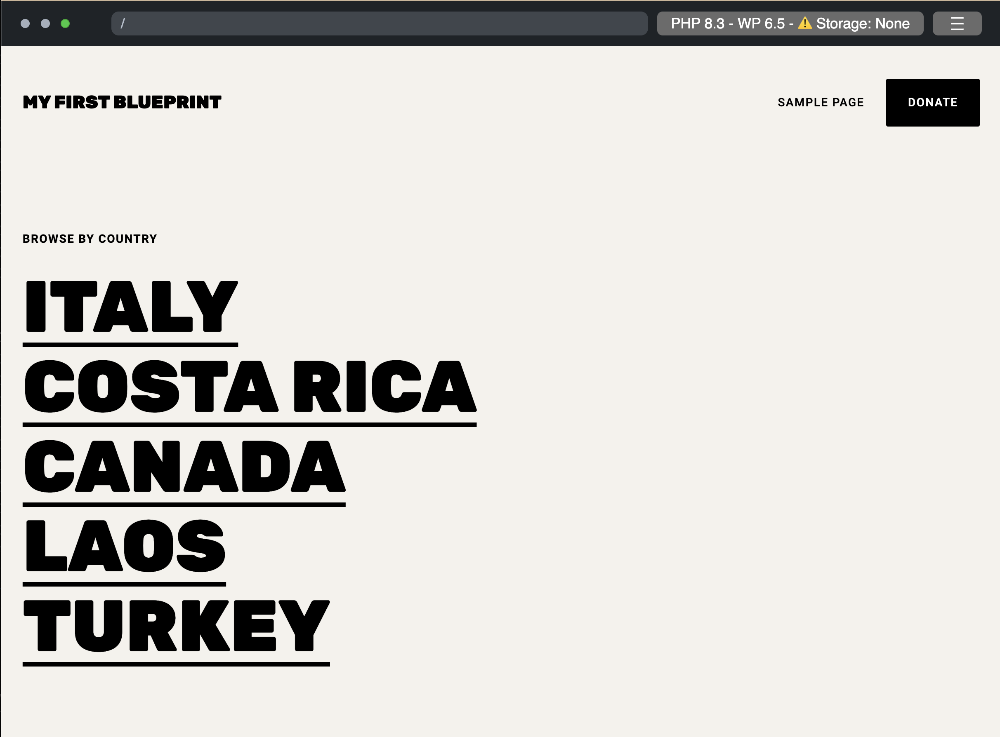

Let's build an elementary Blueprint that

1. Creates a new WordPress site
2. Sets the site title to "My first Blueprint"
3. Installs the _Adventurer_ theme
4. Installs the _Hello Dolly_ plugin from the WordPress plugin directory
5. Installs a custom plugin
6. Changes the site content

## 1. Create a new WordPress site

Let's start by creating a `blueprint.json` file with the following contents:

```json
{}
```

It may seem like nothing is happening, but this Blueprint already spins up a WordPress site with the latest major version.

[<kbd> &nbsp; Run Blueprint &nbsp; </kbd>](https://playground.wordpress.net/#{})

:::tip **Autocomplete**

If you use an IDE, like VS Code or PHPStorm, you can use the [Blueprint JSON Schema](https://playground.wordpress.net/blueprint-schema.json) for an autocompleted Blueprint development experience. Add the following line at the top of your `blueprint.json` file:

```json
{
	"$schema": "https://playground.wordpress.net/blueprint-schema.json"
}
```

:::
Here's what it looks like in VS Code:


## 2. Set the site title to "My first Blueprint"

Blueprints consist of a series of [steps](../steps) that define how to build a WordPress site. Before you write the first step, declare an empty list of steps:

```json
{
	"$schema": "https://playground.wordpress.net/blueprint-schema.json",
	"steps": []
}
```

This Blueprint isn't very exciting—it creates the same default site as the empty Blueprint above. Let's do something about it!

WordPress stores the site title in the `blogname` option. Add your first step and set that option to "My first Blueprint":

```json
{
	"$schema": "https://playground.wordpress.net/blueprint-schema.json",
	"steps": [
		{
			"step": "setSiteOptions",
			"options": {
				"blogname": "My first Blueprint"
			}
		}
	]
}
```

[<kbd> &nbsp; Run Blueprint &nbsp; </kbd>](https://playground.wordpress.net/#https://playground.wordpress.net/#eyIkc2NoZW1hIjoiaHR0cHM6Ly9wbGF5Z3JvdW5kLndvcmRwcmVzcy5uZXQvYmx1ZXByaW50LXNjaGVtYS5qc29uIiwic3RlcHMiOlt7InN0ZXAiOiJzZXRTaXRlT3B0aW9ucyIsIm9wdGlvbnMiOnsiYmxvZ25hbWUiOiJNeSBmaXJzdCBCbHVlcHJpbnQifX1dfQ==)

The [`setSiteOptions` step](../steps#SetSiteOptionsStep) specifies the site options in the WordPress database. The `options` object contains the key-value pairs to set. In this case, you changed the value of the `blogname` key to "My first Blueprint". You can read more about all available steps in the [Blueprint Steps API Reference](../steps).

### Shorthands

You can specify some steps using a shorthand syntax. For example, you could write the `setSiteOptions` step like this:

```json
{
	"$schema": "https://playground.wordpress.net/blueprint-schema.json",
	"siteOptions": {
		"blogname": "My first Blueprint"
	}
}
```

The shorthand syntax and the step syntax correspond with each other. Every step specified with the shorthand syntax is automatically added at the beginning of the `steps` array in an arbitrary order. Which should you choose? Use shorthands when brevity is your main concern, use steps when you need more control over the order of execution.

## 3. Install the _Adventurer_ theme

Adventurer is an open-source theme [available in the WordPress theme directory](https://wordpress.org/themes/adventurer/). Let's install it using the [`installTheme` step](../steps#InstallThemeStep):

```json
{
	"siteOptions": {
		"blogname": "My first Blueprint"
	},
	"steps": [
		{
			"step": "installTheme",
			"themeZipFile": {
				"resource": "wordpress.org/themes",
				"slug": "adventurer"
			}
		}
	]
}
```

[<kbd> &nbsp; Run Blueprint &nbsp; </kbd>](https://playground.wordpress.net/#eyIkc2NoZW1hIjoiaHR0cHM6Ly9wbGF5Z3JvdW5kLndvcmRwcmVzcy5uZXQvYmx1ZXByaW50LXNjaGVtYS5qc29uIiwib3B0aW9ucyI6eyJibG9nbmFtZSI6Ik15IGZpcnN0IEJsdWVwcmludCJ9LCJzdGVwcyI6W3sic3RlcCI6Imluc3RhbGxUaGVtZSIsInRoZW1lWmlwRmlsZSI6eyJyZXNvdXJjZSI6IndvcmRwcmVzcy5vcmcvdGhlbWVzIiwic2x1ZyI6ImFkdmVudHVyZXIifX1dfQ==)

The site should now look like the screenshot below:



### Resources

The `themeZipFile` defines a [resource](/blueprints/steps/resources) and referrences an external file required to complete the step. Playground supports different types of resources, including

-   `url`,
-   `wordpress.org/themes`,
-   `wordpress.org/plugins`,
-   `vfs`(virtual file system), or
-   `literal`.

The example uses the `wordpress.org/themes` resource, which requires a `slug` identical to the one used in WordPress theme directory:

In this case, `https://wordpress.org/themes/<slug>/` becomes `https://wordpress.org/themes/adventurer/`.

:::note
Learn more about the supported resources in the [Blueprint Resources API Reference](/blueprints/steps/resources/).
:::

## 4. Install the _Hello Dolly_ plugin

A classic WordPress plugin that displays random lyrics from the song "Hello, Dolly!" in the admin dashboard. Let's install it using the [`installPlugin` step](../steps#InstallPluginStep):

```json
{
	"siteOptions": {
		"blogname": "My first Blueprint"
	},
	"steps": [
		{
			"step": "installTheme",
			"themeZipFile": {
				"resource": "wordpress.org/themes",
				"slug": "adventurer"
			}
		},
		{
			"step": "installPlugin",
			"pluginZipFile": {
				"resource": "wordpress.org/plugins",
				"slug": "hello-dolly"
			}
		}
	]
}
```

[<kbd> &nbsp; Run Blueprint &nbsp; </kbd>](https://playground.wordpress.net/#eyJzaXRlT3B0aW9ucyI6eyJibG9nbmFtZSI6Ik15IGZpcnN0IEJsdWVwcmludCJ9LCJzdGVwcyI6W3sic3RlcCI6Imluc3RhbGxUaGVtZSIsInRoZW1lWmlwRmlsZSI6eyJyZXNvdXJjZSI6IndvcmRwcmVzcy5vcmcvdGhlbWVzIiwic2x1ZyI6ImFkdmVudHVyZXIifX0seyJzdGVwIjoiaW5zdGFsbFBsdWdpbiIsInBsdWdpblppcEZpbGUiOnsicmVzb3VyY2UiOiJ3b3JkcHJlc3Mub3JnL3BsdWdpbnMiLCJzbHVnIjoiaGVsbG8tZG9sbHkifX1dfQ==)

The Hello Dolly plugin is now installed and activated.

Like the `themeZipFile`, the `pluginZipFile` defines a reference to an external file required for the step. The example uses the `wordpress.org/plugins` resource to install the plugin with the matching `slug` from the WordPress plugin directory.

## 5. Install a custom plugin

Let's install a custom WordPress plugin that adds a message to the admin dashboard:

```php
<?php
/*
Plugin Name: "Hello" on the Dashboard
Description: A custom plugin to showcase WordPress Blueprints
Version: 1.0
Author: WordPress Contributors
*/

function my_custom_plugin() {
    echo '<h1>Hello from My Custom Plugin!</h1>';
}

add_action('admin_notices', 'my_custom_plugin');
```

You can use the [installPlugin](../steps#InstallPluginStep), but that requires creating a ZIP file. Let's start with something different to see if the plugin works:

1. Create a `wp-content/plugins/hello-from-the-dashboard` directory using the [`mkdir` step](../steps#MkdirStep).
2. Write a `plugin.php` file using the [`writeFile` step](../steps#WriteFileStep).
3. Activate the plugin using the [`activatePlugin` step](../steps#ActivatePluginStep).

Here's what that looks like in a Blueprint:

```json
{
	// ...
	"steps": [
		// ...
		{
			"step": "mkdir",
			"path": "/wordpress/wp-content/plugins/hello-from-the-dashboard"
		},
		{
			"step": "writeFile",
			"path": "/wordpress/wp-content/plugins/hello-from-the-dashboard/plugin.php",
			"data": "<?php\n/*\nPlugin Name: \"Hello\" on the Dashboard\nDescription: A custom plugin to showcase WordPress Blueprints\nVersion: 1.0\nAuthor: WordPress Contributors\n*/\n\nfunction my_custom_plugin() {\n    echo '<h1>Hello from My Custom Plugin!</h1>';\n}\n\nadd_action('admin_notices', 'my_custom_plugin');"
		},
		{
			"step": "activatePlugin",
			"pluginPath": "hello-from-the-dashboard/plugin.php"
		}
	]
}
```

The last thing to do is log the user in as an admin. You can do that with a shorthand of the [`login` step](../steps#LoginStep):

```json
{
	"login": true,
	"steps": {
		// ...
	}
}
```

Here's the complete Blueprint:

```json
{
	"$schema": "https://playground.wordpress.net/blueprint-schema.json",
	"login": true,
	"siteOptions": {
		"blogname": "My first Blueprint"
	},
	"steps": [
		{
			"step": "installTheme",
			"themeZipFile": {
				"resource": "wordpress.org/themes",
				"slug": "adventurer"
			}
		},
		{
			"step": "installPlugin",
			"pluginZipFile": {
				"resource": "wordpress.org/plugins",
				"slug": "hello-dolly"
			}
		},
		{
			"step": "mkdir",
			"path": "/wordpress/wp-content/plugins/hello-from-the-dashboard"
		},
		{
			"step": "writeFile",
			"path": "/wordpress/wp-content/plugins/hello-from-the-dashboard/plugin.php",
			"data": "<?php\n/*\nPlugin Name: \"Hello\" on the Dashboard\nDescription: A custom plugin to showcase WordPress Blueprints\nVersion: 1.0\nAuthor: WordPress Contributors\n*/\n\nfunction my_custom_plugin() {\n    echo '<h1>Hello from My Custom Plugin!</h1>';\n}\n\nadd_action('admin_notices', 'my_custom_plugin');"
		},
		{
			"step": "activatePlugin",
			"pluginPath": "hello-from-the-dashboard/plugin.php"
		}
	]
}
```

[<kbd> &nbsp; Run Blueprint &nbsp; </kbd>](https://playground.wordpress.net/#eyJsb2dpbiI6dHJ1ZSwic2l0ZU9wdGlvbnMiOnsiYmxvZ25hbWUiOiJNeSBmaXJzdCBCbHVlcHJpbnQifSwic3RlcHMiOlt7InN0ZXAiOiJpbnN0YWxsVGhlbWUiLCJ0aGVtZVppcEZpbGUiOnsicmVzb3VyY2UiOiJ3b3JkcHJlc3Mub3JnL3RoZW1lcyIsInNsdWciOiJhZHZlbnR1cmVyIn19LHsic3RlcCI6Imluc3RhbGxQbHVnaW4iLCJwbHVnaW5aaXBGaWxlIjp7InJlc291cmNlIjoid29yZHByZXNzLm9yZy9wbHVnaW5zIiwic2x1ZyI6ImhlbGxvLWRvbGx5In19LHsic3RlcCI6Im1rZGlyIiwicGF0aCI6Ii93b3JkcHJlc3Mvd3AtY29udGVudC9wbHVnaW5zL2hlbGxvLW9uLXRoZS1kYXNoYm9hcmQifSx7InN0ZXAiOiJ3cml0ZUZpbGUiLCJwYXRoIjoiL3dvcmRwcmVzcy93cC1jb250ZW50L3BsdWdpbnMvaGVsbG8tb24tdGhlLWRhc2hib2FyZC9wbHVnaW4ucGhwIiwiZGF0YSI6Ijw/cGhwXG4vKlxuUGx1Z2luIE5hbWU6IFwiSGVsbG9cIiBvbiB0aGUgRGFzaGJvYXJkXG5EZXNjcmlwdGlvbjogQSBjdXN0b20gcGx1Z2luIHRvIHNob3djYXNlIFdvcmRQcmVzcyBCbHVlcHJpbnRzXG5WZXJzaW9uOiAxLjBcbkF1dGhvcjogV29yZFByZXNzIENvbnRyaWJ1dG9yc1xuKi9cblxuZnVuY3Rpb24gbXlfY3VzdG9tX3BsdWdpbigpIHtcbiAgICBlY2hvICc8aDE+SGVsbG8gZnJvbSBNeSBDdXN0b20gUGx1Z2luITwvaDE+Jztcbn1cblxuYWRkX2FjdGlvbignYWRtaW5fbm90aWNlcycsICdteV9jdXN0b21fcGx1Z2luJyk7In0seyJzdGVwIjoiYWN0aXZhdGVQbHVnaW4iLCJwbHVnaW5QYXRoIjoiaGVsbG8tb24tdGhlLWRhc2hib2FyZC9wbHVnaW4ucGhwIn1dfQ==)

That's what it looks like when you navigate to the dashboard:


### Create a plugin and zip it

Encoding PHP files as `JSON` can be useful for quick testing, but it's inconvenient and difficult to read. Instead, create a file with the plugin code, compress it, and use the `ZIP` file as the `resource` in the [`installPlugin` step](../steps#InstallPluginStep) to install it (the path in the `URL` should match the one in your GitHub repository):

```json
{
	"$schema": "https://playground.wordpress.net/blueprint-schema.json",
	"login": true,
	"siteOptions": {
		"blogname": "My first Blueprint"
	},
	"steps": [
		{
			"step": "installTheme",
			"themeZipFile": {
				"resource": "wordpress.org/themes",
				"slug": "adventurer"
			}
		},
		{
			"step": "installPlugin",
			"pluginZipFile": {
				"resource": "wordpress.org/plugins",
				"slug": "hello-dolly"
			}
		},
		{
			"step": "installPlugin",
			"pluginZipFile": {
				"resource": "url",
				"url": "https://raw.githubusercontent.com/wordpress/blueprints/trunk/docs/assets/hello-from-the-dashboard.zip"
			}
		}
	]
}
```

You can shorten that Blueprint even more using the shorthand syntax:

```json
{
	"$schema": "https://playground.wordpress.net/blueprint-schema.json",
	"login": true,
	"siteOptions": {
		"blogname": "My first Blueprint"
	},
	"plugins": ["hello-dolly", "https://raw.githubusercontent.com/wordpress/blueprints/trunk/docs/assets/hello-from-the-dashboard.zip"],
	"steps": [
		{
			"step": "installTheme",
			"themeZipFile": {
				"resource": "wordpress.org/themes",
				"slug": "adventurer"
			}
		}
	]
}
```

[<kbd> &nbsp; Run Blueprint &nbsp; </kbd>](https://playground.wordpress.net/#eyIkc2NoZW1hIjoiaHR0cHM6Ly9wbGF5Z3JvdW5kLndvcmRwcmVzcy5uZXQvYmx1ZXByaW50LXNjaGVtYS5qc29uIiwibG9naW4iOnRydWUsInNpdGVPcHRpb25zIjp7ImJsb2duYW1lIjoiTXkgZmlyc3QgQmx1ZXByaW50In0sInBsdWdpbnMiOlsiaGVsbG8tZG9sbHkiLCJodHRwczovL3Jhdy5naXRodWJ1c2VyY29udGVudC5jb20vYWRhbXppZWwvYmx1ZXByaW50cy90cnVuay9kb2NzL2hlbGxvLW9uLXRoZS1kYXNoYm9hcmQuemlwIl0sInN0ZXBzIjpbeyJzdGVwIjoiaW5zdGFsbFRoZW1lIiwidGhlbWVaaXBGaWxlIjp7InJlc291cmNlIjoid29yZHByZXNzLm9yZy90aGVtZXMiLCJzbHVnIjoiYWR2ZW50dXJlciJ9fV19)

## 6. Change the site content

Finally, let's delete the default content of the site and import a new one from a WordPress export file (WXR).

### Delete the old content

There isn't a Blueprint step to delete the default content, but you can do that with a snippet of PHP code:

```php
<?php
require '/wordpress/wp-load.php';

// Delete all posts and pages
$posts = get_posts(array(
    'numberposts' => -1,
    'post_type' => array('post', 'page'),
    'post_status' => 'any'
));

foreach ($posts as $post) {
    wp_delete_post($post->ID, true);
}
```

To run that code during the site setup, use the [`runPHP` step](../steps#RunPHPStep):

```json
{
	// ...
	"steps": [
		// ...
		{
			"step": "runPHP",
			"code": "<?php\nrequire '/wordpress/wp-load.php';\n\n$posts = get_posts(array(\n    'numberposts' => -1,\n    'post_type' => array('post', 'page'),\n    'post_status' => 'any'\n));\n\nforeach ($posts as $post) {\n    wp_delete_post($post->ID, true);\n}"
		}
	]
}
```

### Import the new content

Let's use the [`importWxr` step](../steps#ImportWXRStep) to import a WordPress export (`WXR`) file that helps test WordPress themes. The file is available in the [WordPress/theme-test-data](https://github.com/WordPress/theme-test-data) repository, and you can access it via its `raw.githubusercontent.com` address: [https://raw.githubusercontent.com/WordPress/theme-test-data/master/themeunittestdata.wordpress.xml](https://raw.githubusercontent.com/WordPress/theme-test-data/master/themeunittestdata.wordpress.xml).

Here's what the final Blueprint looks like:

```json
{
	"$schema": "https://playground.wordpress.net/blueprint-schema.json",
	"login": true,
	"siteOptions": {
		"blogname": "My first Blueprint"
	},
	"plugins": ["hello-dolly", "https://raw.githubusercontent.com/wordpress/blueprints/trunk/docs/assets/hello-from-the-dashboard.zip"],
	"steps": [
		{
			"step": "installTheme",
			"themeZipFile": {
				"resource": "wordpress.org/themes",
				"slug": "adventurer"
			}
		},
		{
			"step": "runPHP",
			"code": "<?php\nrequire '/wordpress/wp-load.php';\n\n$posts = get_posts(array(\n    'numberposts' => -1,\n    'post_type' => array('post', 'page'),\n    'post_status' => 'any'\n));\n\nforeach ($posts as $post) {\n    wp_delete_post($post->ID, true);\n}"
		},
		{
			"step": "importWxr",
			"file": {
				"resource": "url",
				"url": "https://raw.githubusercontent.com/WordPress/theme-test-data/master/themeunittestdata.wordpress.xml"
			}
		}
	]
}
```

[<kbd> &nbsp; Run Blueprint &nbsp; </kbd>](https://playground.wordpress.net/#eyIkc2NoZW1hIjoiaHR0cHM6Ly9wbGF5Z3JvdW5kLndvcmRwcmVzcy5uZXQvYmx1ZXByaW50LXNjaGVtYS5qc29uIiwibG9naW4iOnRydWUsInNpdGVPcHRpb25zIjp7ImJsb2duYW1lIjoiTXkgZmlyc3QgQmx1ZXByaW50In0sInBsdWdpbnMiOlsiaGVsbG8tZG9sbHkiLCJodHRwczovL3Jhdy5naXRodWJ1c2VyY29udGVudC5jb20vYWRhbXppZWwvYmx1ZXByaW50cy90cnVuay9kb2NzL2Fzc2V0cy9oZWxsby1mcm9tLXRoZS1kYXNoYm9hcmQuemlwIl0sInN0ZXBzIjpbeyJzdGVwIjoiaW5zdGFsbFRoZW1lIiwidGhlbWVaaXBGaWxlIjp7InJlc291cmNlIjoid29yZHByZXNzLm9yZy90aGVtZXMiLCJzbHVnIjoiYWR2ZW50dXJlciJ9fSx7InN0ZXAiOiJydW5QSFAiLCJjb2RlIjoiPD9waHBcbnJlcXVpcmUgJy93b3JkcHJlc3Mvd3AtbG9hZC5waHAnO1xuXG4kcG9zdHMgPSBnZXRfcG9zdHMoYXJyYXkoXG4gICAgJ251bWJlcnBvc3RzJyA9PiAtMSxcbiAgICAncG9zdF90eXBlJyA9PiBhcnJheSgncG9zdCcsICdwYWdlJyksXG4gICAgJ3Bvc3Rfc3RhdHVzJyA9PiAnYW55J1xuKSk7XG5cbmZvcmVhY2ggKCRwb3N0cyBhcyAkcG9zdCkge1xuICAgIHdwX2RlbGV0ZV9wb3N0KCRwb3N0LT5JRCwgdHJ1ZSk7XG59In0seyJzdGVwIjoiaW1wb3J0V3hyIiwiZmlsZSI6eyJyZXNvdXJjZSI6InVybCIsInVybCI6Imh0dHBzOi8vcmF3LmdpdGh1YnVzZXJjb250ZW50LmNvbS9Xb3JkUHJlc3MvdGhlbWUtdGVzdC1kYXRhL21hc3Rlci90aGVtZXVuaXR0ZXN0ZGF0YS53b3JkcHJlc3MueG1sIn19XX0=)

And that's it. Congratulations on creating your first Blueprint! 🥳
