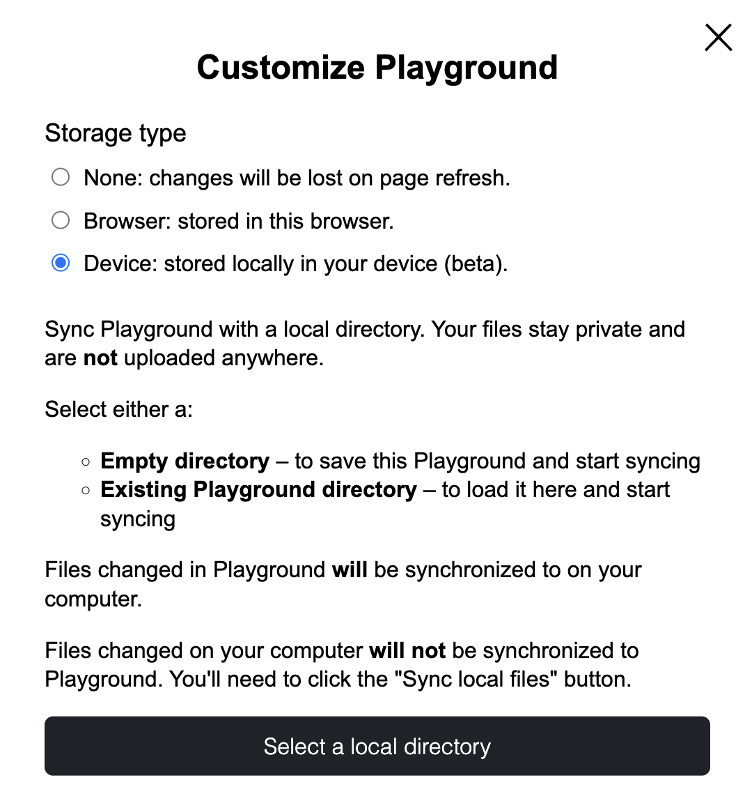

# Build

WordPress Playground can help you to create and learn WordPress quickly, even on mobile with no signal. You can use Playground where you work best, whether that’s in the browser, Node.js, mobile apps, VS Code, or elsewhere.

## Setting quickly a local WordPress environment

You can seamlessly integrate Playground into your development workflow to launch a local WordPress environment quickly for testing your code. You can do this directly [from the terminal](/developers/local-development/wp-now) or [your preferred IDE.](/developers/local-development/vscode-extension)

## Save changes done on a Block Theme and create Github Pull Requests

You can connect your Playground instance to a GitHub repository and create a Pull Request with the changes you’ve done through the WordPress UI, leveraging the [Create Block Theme](https://wordpress.org/plugins/create-block-theme/) plugin.

With this workflow, you could build a block theme completely in your browser and save your change to GitHub, or you could improve/fix an existing one.

<iframe width="800" src="https://www.youtube.com/embed/94KnoFhQg1g" frameborder="0" allow="accelerometer; autoplay; clipboard-write; encrypted-media; gyroscope; picture-in-picture" allowfullscreen></iframe>

Some more examples of this workflow:

-   [Developer Hours: Creating WordPress Playground Blueprints for Testing and Demos](https://www.youtube.com/watch?v=gKrij8V3nK0&t=2488s)
-   [Recap Hallway Hangout: Theme Building with Playground, Create-block-theme plugin, and GitHub](https://make.wordpress.org/core/2024/06/25/recap-hallway-hangout-theme-building-with-playground-create-block-theme-plugin-and-github/)

## Synchronize your playground instance with a local folder and create Github Pull Requests

With Google Chrome (it only works with this browser, for now) you can synchronize your Playground instance with a local directory, that can be either:

-   And empty directory – to save this Playground and start syncing
-   An existing directory – to load it here and start syncing

Regarding changes done on both sides of the connection:

-   Files changed in Playground will be synchronized to on your computer.
-   Files changed on your computer will not be synchronized to Playground. You'll need to click the "Sync local files" button.

With this workflow you can create directly GitHub PRs from your changes done on your local directory.

See here a little demo of this workflow in action:

<iframe width="800" src="https://www.youtube.com/embed/UYK88eZqrjo" frameborder="0" allow="accelerometer; autoplay; clipboard-write; encrypted-media; gyroscope; picture-in-picture" allowfullscreen></iframe>

## Integrate with other APIs to create new tools.

Playground can be combined with different APIs to create amazing tools. The possibilities are endless.

You can [use WordPress Playground in Node.js](/developers/local-development/php-wasm-node) to create new tools. The [@php-wasm/node package](https://npmjs.org/@php-wasm/node), which ships the PHP WebAssembly runtime, is the package used for [https://playground.wordpress.net/](https://playground.wordpress.net/), for example.

Another interesting app built on top of Playground is **Translate Live** (see [example](https://translate.wordpress.org/projects/wp-plugins/friends/dev/de/default/playground/)) which, in combination with Open AI provides a WordPress translations tool “in place” where translations can be seen and modified in their real context (see example). Read more about this tool at [Translate Live: Updates to the Translation Playground](https://make.wordpress.org/polyglots/2023/05/08/translate-live-updates-to-the-translation-playground/)

## Work offline and as a native app

When you first visit [playground.wordpress.net](https://playground.wordpress.net/), your browser automatically caches all the necessary files to use Playground. From that point on, you can access [playground.wordpress.net](https://playground.wordpress.net/), even without internet connection, ensuring you can continue working on your projects without interruptions.

You can also install Playground on your device as a Progressive Web App (PWA) to launch the Playground directly from your home screen—just like a native app.

Read [Introducing Offline Mode and PWA Support for WordPress Playground](https://make.wordpress.org/playground/2024/08/05/offline-mode-and-pwa-support/) for more info.

## Embed a WordPress site in non-web environments

The [How to ship a real WordPress site in a native iOS app via Playground?](../guides/wordpress-native-ios-app) guide shows how we can leverage Playground to wrap a WordPress site into an IOS app.
