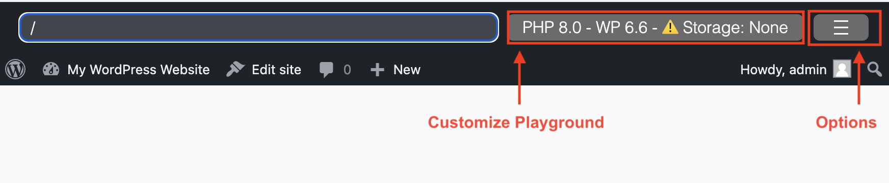
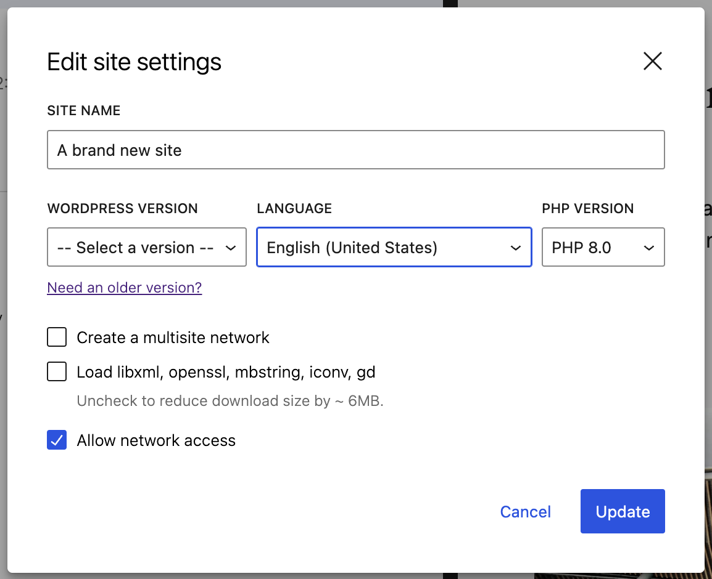
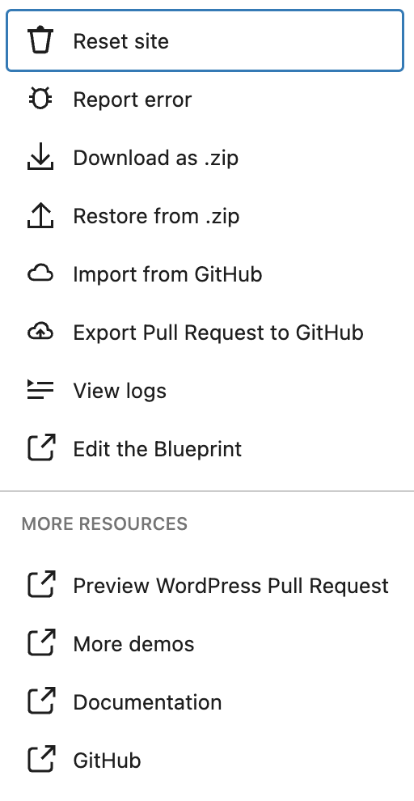
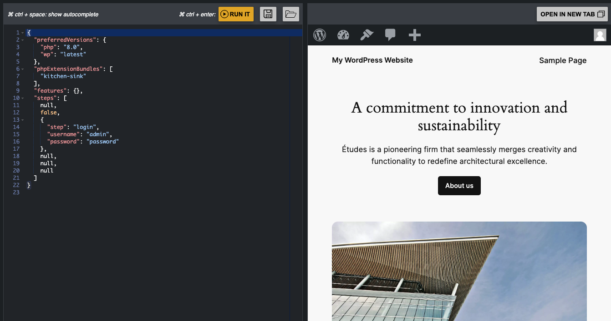

# WordPress Playground web instance

[https://playground.wordpress.net/](https://playground.wordpress.net/) is a versatile web tool that allows developers to run WordPress in a browser without needing a server. This environment is particularly useful for testing plugins, themes, and other WordPress features quickly and efficiently.

Some key features:

-   **Browser-based**: No need for a local server setup.
-   **Instant Setup**: Run WordPress with a single click.
-   **Testing Environment**: Ideal for testing plugins and themes.

Via [Query Params](/developers/apis/query-api/) we can directly load in the Playground instance things such as a specific version of WordPress, a theme, a plugin or a more complex setup via blueprints (check [here](/quick-start-guide#try-a-block-a-theme-or-a-plugin) some examples).

From the Playground website there are also available some toolbars to customize your playground instance and to provide quick access to some resources and utilities.

## Customize Playground

The options available from the "Customize Playground" window correpond to the following [Query API options](/developers/apis/query-api#available-options):

-   `storage`
-   `php`
-   `php-extension-bundle`
-   `networking`
-   `wp`

:::tip

You need to activate "Network access" to be able to browse for [plugins](https://w.org/plugins) and [themes](https://w.org/themes) from your WordPress instance.
:::

## Playground Options Menu

This menu contains links to some Playground resources and tools:

-   **Reset Site**: - It will wipe out all data and reload the page with a new site.
-   **Report error**: If you have any issue with WP Playground yoy can report it using the form available from this option. You can help resolve issues with Playground by sharing the error details with development team behind Playground.
-   **Download as zip**: It creates a `.zip` with the setup of the Playground instance including any themes or plugins installed. This `.zip` won't include content and database changes.
-   **Restore from zip**: It allows you to recreate a Playground instance using any `.zip` generated with the "Download as zip" option
-   **Import from Github**: This option allows you to import plugins, themes, and wp-content directories directly from your public GitHub repositories. To enable this feature, connect your GitHub account with WordPress Playground.

-   **Export Pull Request to GitHub**: This option allows you to export WordPress plugins, themes, and entire wp-content directories as pull requests to any public GitHub repository. Check [here](https://www.youtube.com/watch?v=gKrij8V3nK0&t=2488s) a demo of using this option.

-   **View Logs**: This option will take you to modal that will show any error logs for Playground, WordPress and PHP.

-   **Edit the blueprint**: This option will open the current blueprint used for the Playground instance in the [Blueprints Builder tool](https://playground.wordpress.net/builder/builder.html). From this tool you'll be able to edit the blueprint online and run a new Playground instance with your edited version of the blueprint.

:::caution

The site at https://playground.wordpress.net is there to support the community, but there are no guarantees it will continue to work if the traffic grows significantly.

If you need certain availability, you should [host your own WordPress Playground](/developers/architecture/host-your-own-playground).
:::
