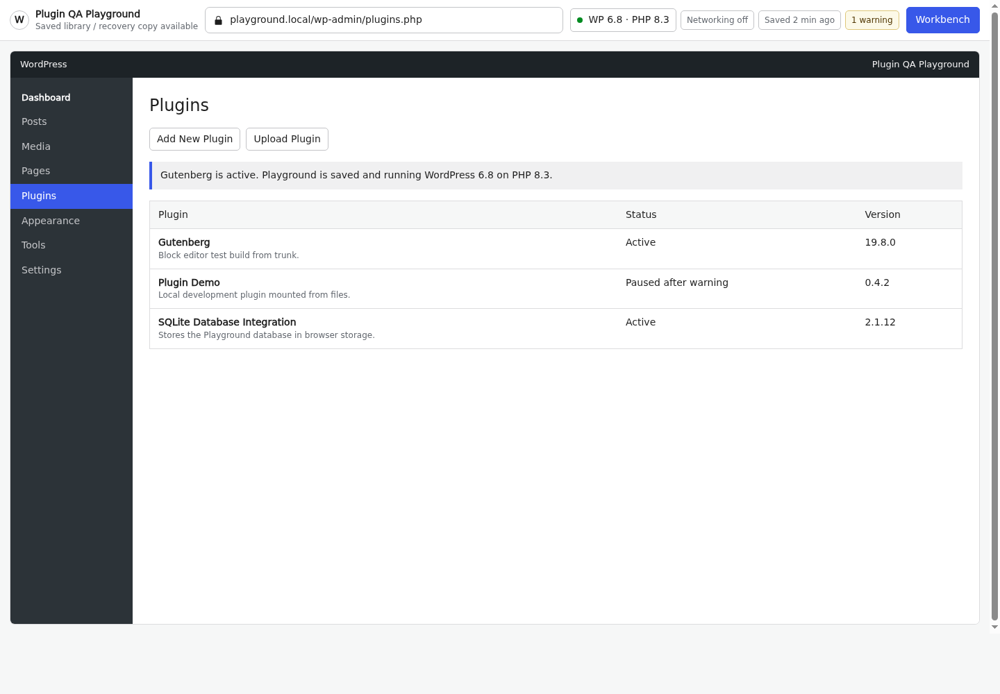
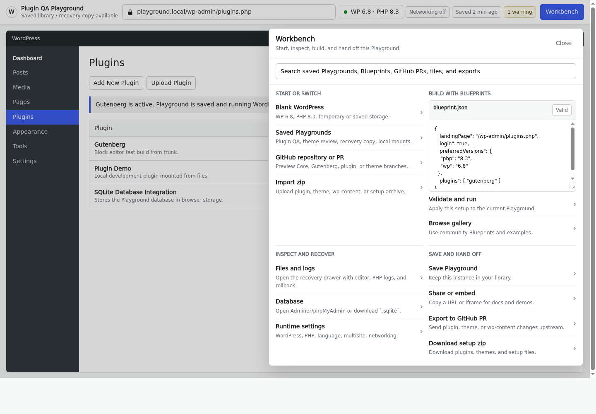
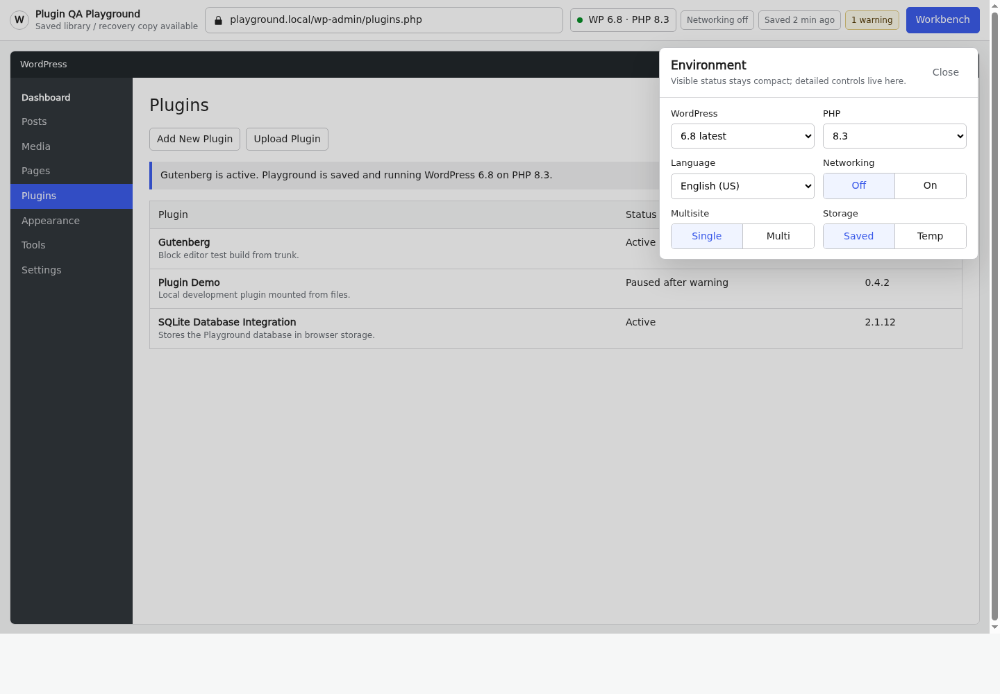
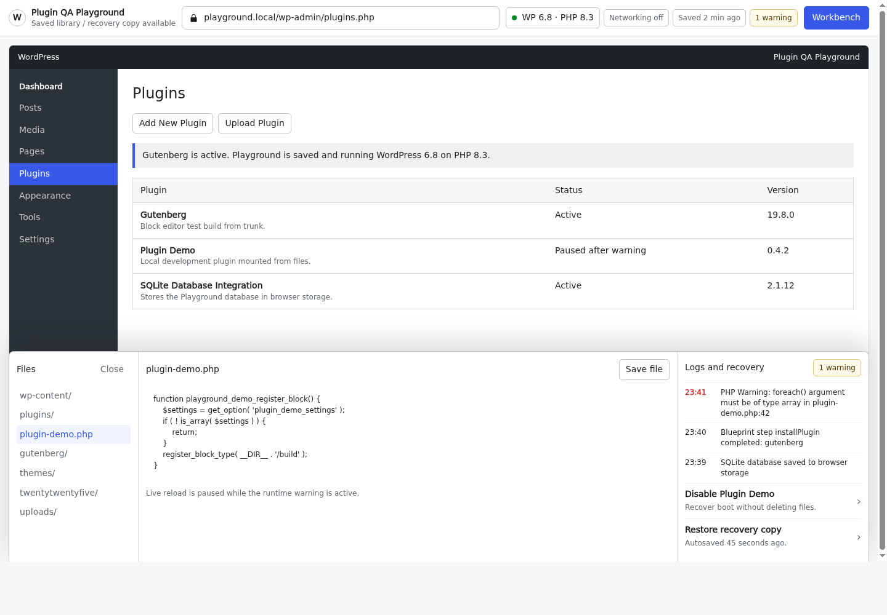
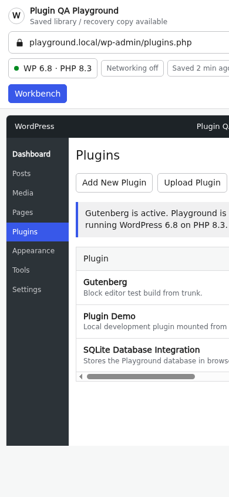
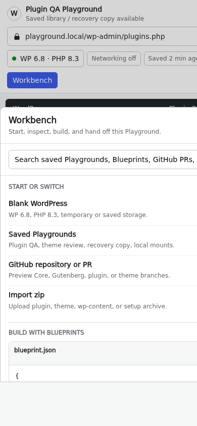
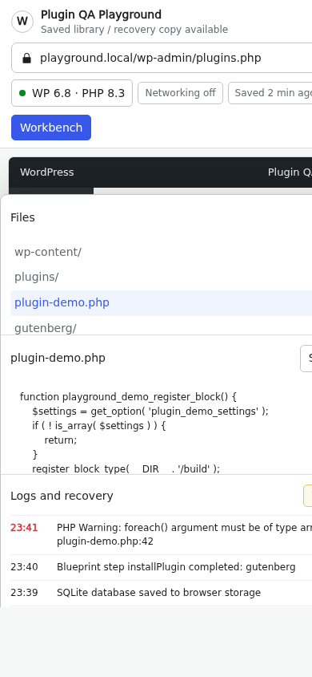

# No-Sidebar Workbench Screenshots

This direction responds to the critique that the previous prototype had a persistent Playground sidebar and too many visible buttons.

- Prototype: [`no-sidebar-workbench.html`](./no-sidebar-workbench.html)
- Notes: [`no-sidebar-workbench-notes.md`](./no-sidebar-workbench-notes.md)

## Desktop Main

## Desktop Workbench

## Desktop Environment

## Desktop Recovery Drawer

## Mobile Main

## Mobile Workbench

## Error Recovery

