# Playground Redesign Screenshots

Review screenshots for the standalone Playground redesign prototype explored outside the production app.

## Final Prototype

### Desktop main workspace

### Desktop launch and saved Playgrounds

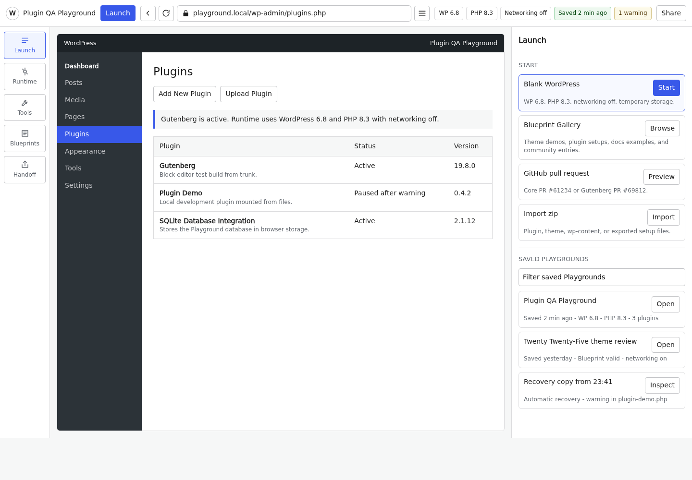

### Desktop files and logs drawer

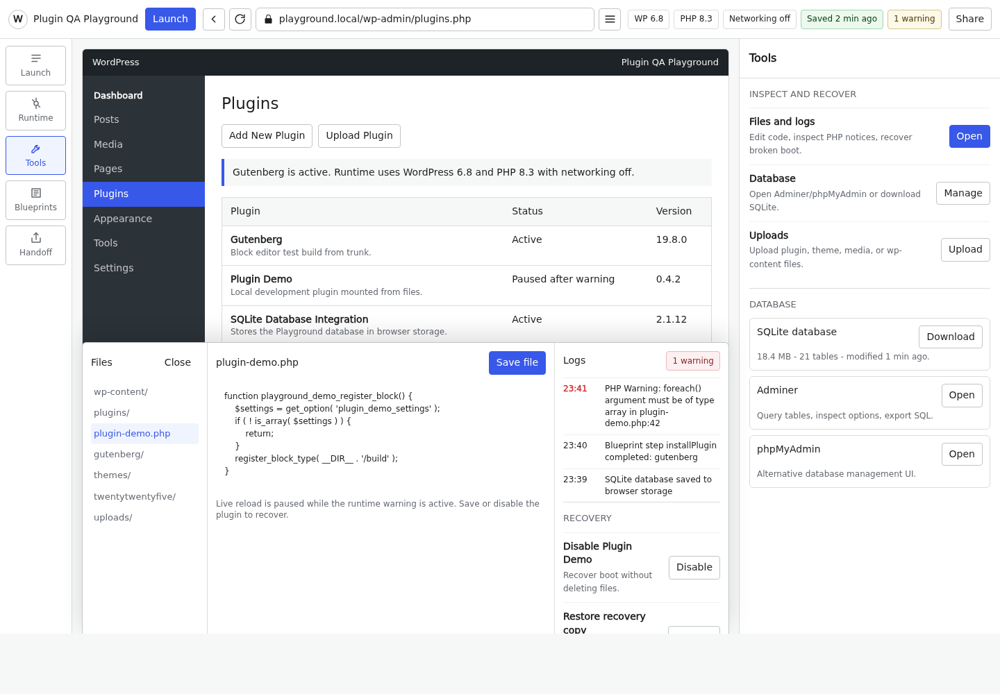

### Desktop Blueprint panel

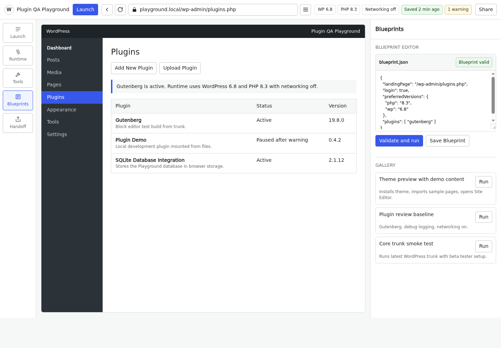

### Mobile main workspace

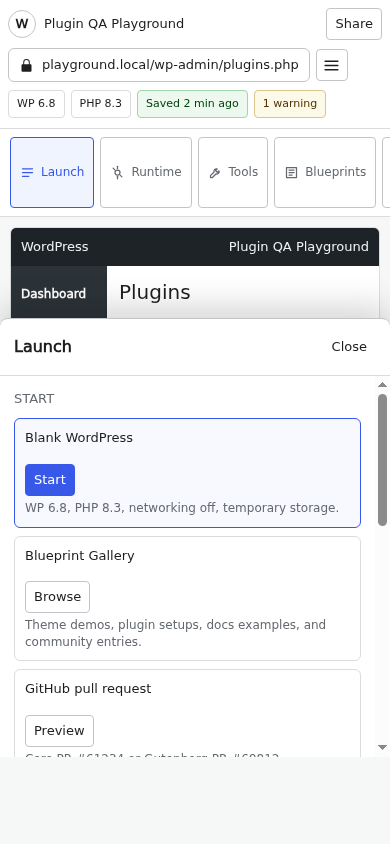

### Mobile tools and recovery drawer

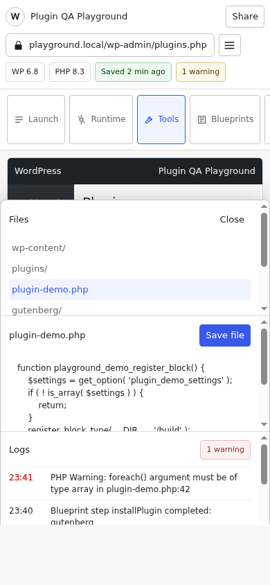

### Error and log state

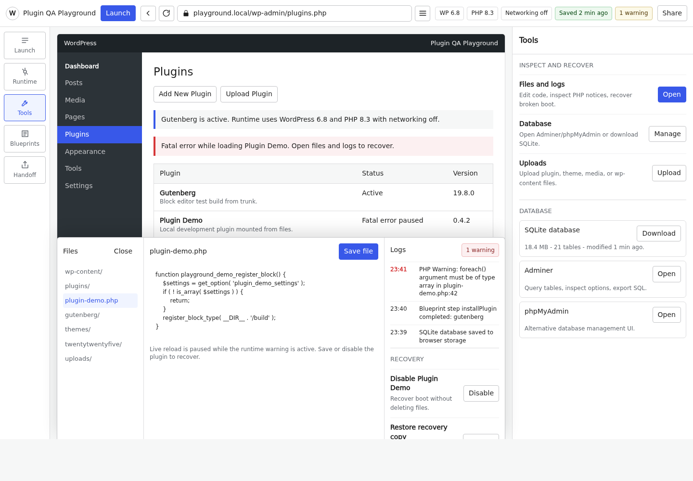

## Current Playground Reference

### Current desktop

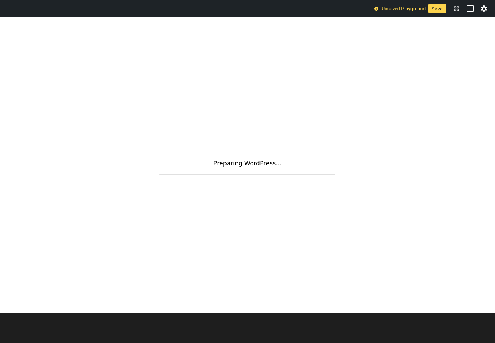

### Current mobile

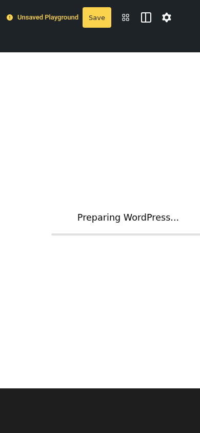

## PR 3658 Reference States

### Main

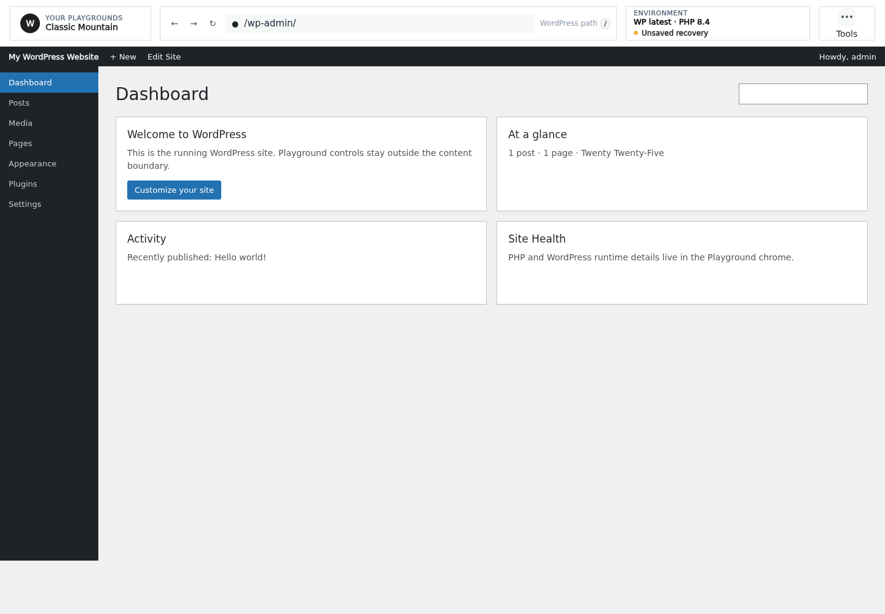

### Runtime

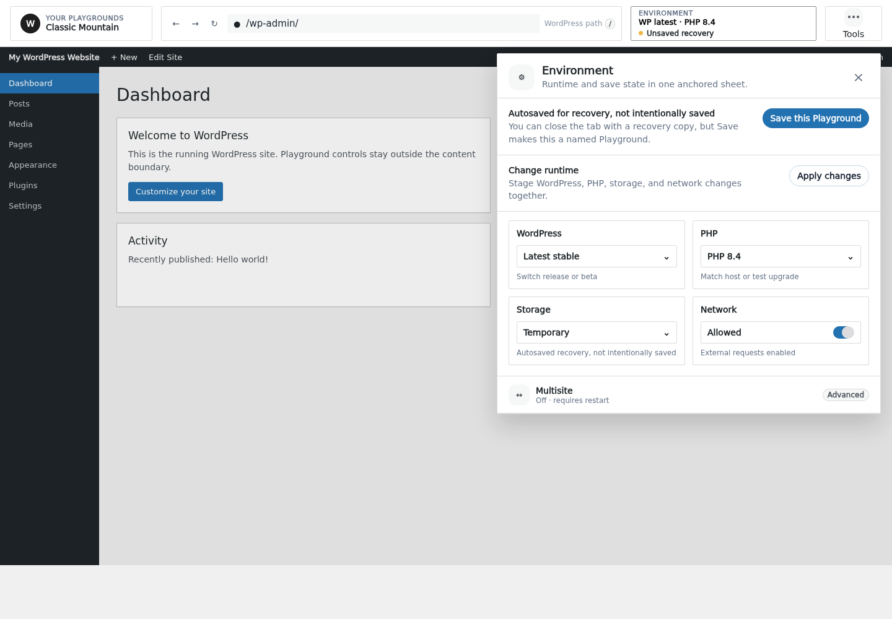

### Files

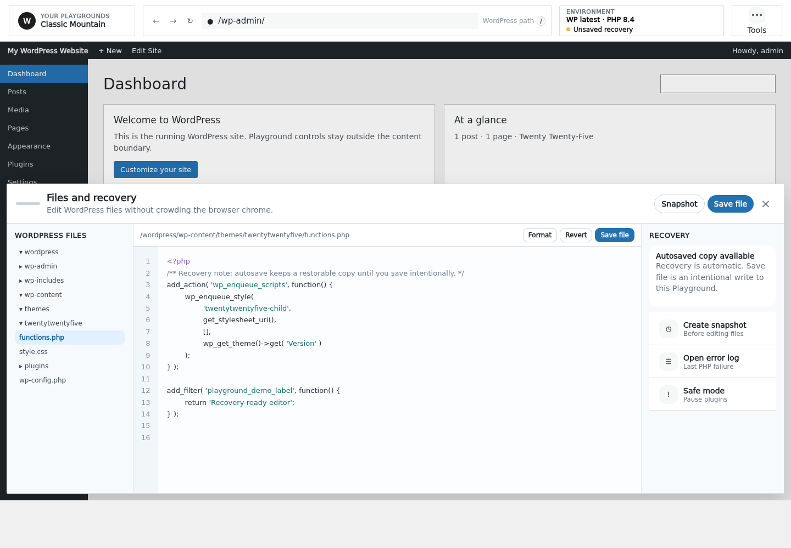

### Current Playground

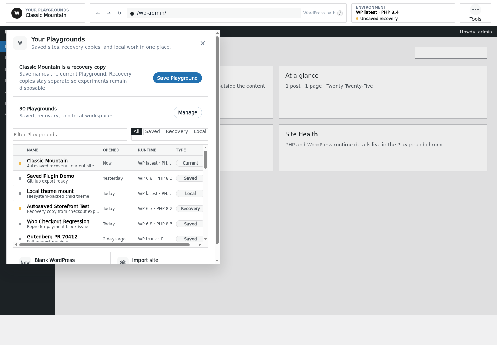

### Share

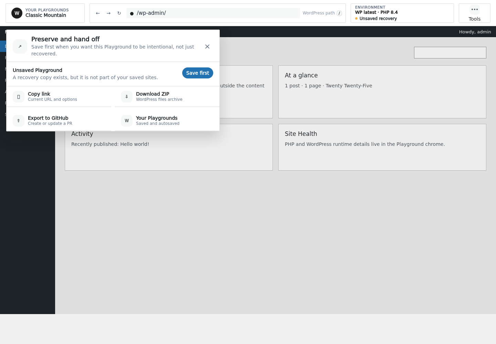

### Command

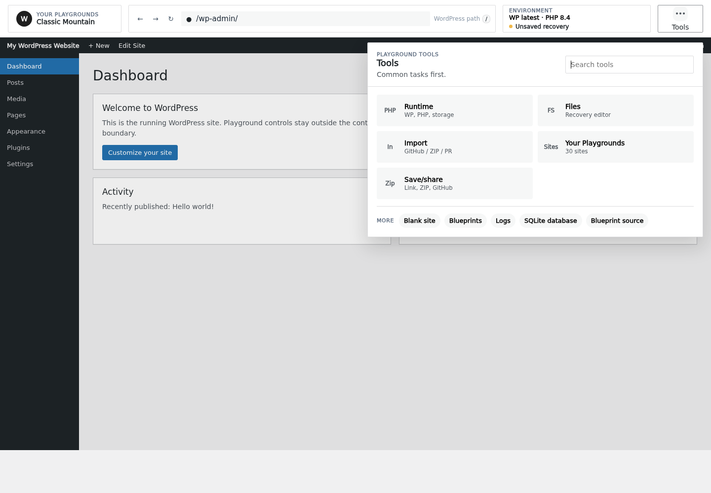
